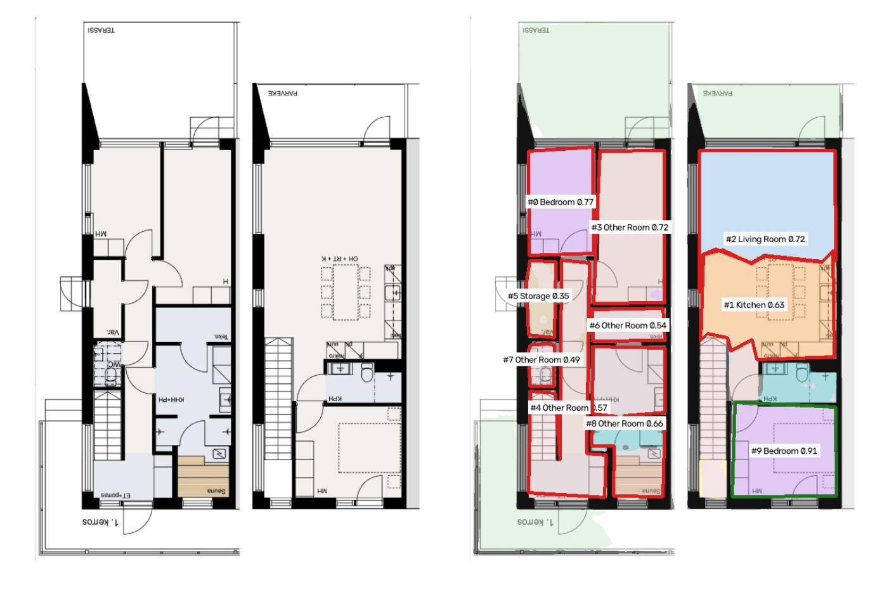
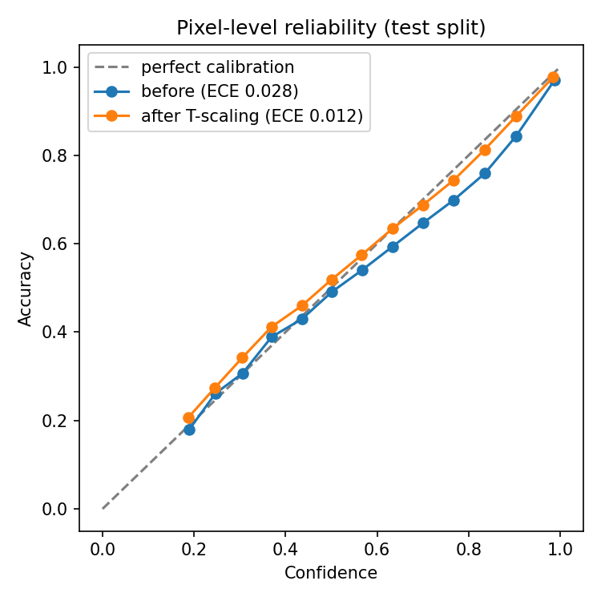

# floorplan-intel

Turning floor-plan drawings into room-level data, with a confidence score on every room.

I built this as a self-directed side project while finishing my PhD, to try out an idea from my doctoral work (anomaly detection on semiconductor wafer images with Seagate) on a different kind of technical drawing. The question I was interested in was not only "can a model find the rooms?" but "does it know which of its answers to trust?"

It is a research prototype. It has not been tested on UK drawings and should not be used for any real decision.



*Example from the CubiCasa5K test set (the drawing is rotated 180°). Green outlines are rooms the model is confident about; red ones are flagged for a person to check. The two room types it got wrong (#4 and #7) were both below the review threshold.*

## What it does

You give it a floor plan as an image or PDF. It returns a JSON file listing each room it found: the room type, its outline as a polygon, its size relative to the other rooms, which rooms it borders, and a confidence score. Any room scoring below a threshold you choose (0.8 by default) is marked `needs_review`.

The steps are:

1. A U-Net with an EfficientNet-B0 encoder labels every pixel as wall, background, outdoor space or one of eight room types.
2. The model's outputs are recalibrated with temperature scaling, and averaged over several passes with dropout left on (MC-dropout), so the probabilities are closer to honest.
3. Post-processing finds the spaces enclosed by walls, decides each one's type by a probability-weighted vote, and works out polygons, areas and neighbours.

Step 3 went through one revision. My first version grouped pixels by predicted class, which broke rooms into fragments whenever the model was unsure about a few pixels. Finding the enclosed spaces first and voting on the type afterwards cut the room-count error a lot.

## Results

Trained and tested on CubiCasa5K (4,199 training plans, 400 validation, 400 test; one training file had a broken annotation and was skipped). Training ran for 40 epochs on a laptop RTX 3070 Ti, about two minutes per epoch. The best validation mIoU was 0.645 at epoch 38; the numbers below are on the test set, which was not used for training or model selection.

| Metric (test set, 400 plans) | Value |
|---|---|
| Mean IoU, 12 classes | 0.618 |
| Room count exactly right | 22.3% of plans |
| Room count error | 2.8 rooms per plan on average |
| Calibration error (pixel ECE), before → after temperature scaling | 0.028 → 0.012 |
| Fitted temperature | 1.15 |

The temperature came out above 1, which means the trained model was somewhat overconfident, and scaling roughly halved the calibration error on data it had not seen.



*Points below the dashed line mean the model was more confident than it was accurate. Before scaling (blue) this happens mostly at high confidence; after scaling (orange) the curve sits close to the diagonal.*

Per class:

| Class | IoU | | Class | IoU |
|---|---|---|---|---|
| Background | 0.90 | | Bath | 0.68 |
| Bedroom | 0.81 | | Entry | 0.65 |
| Wall | 0.75 | | Storage | 0.54 |
| Living room | 0.74 | | Other room | 0.53 |
| Kitchen | 0.71 | | Garage | 0.41 |
| Outdoor | 0.70 | | Railing | 0.00 |

Railing scores zero because railings are thin lines that mostly disappear when I scale drawings down to 1,024 px, and they are rare. Garages are rare in this dataset (it is mostly Finnish flats). "Other room" is a catch-all in CubiCasa5K covering generic rooms, halls, offices, utility rooms and more, so a middling score there is not surprising.

## What doesn't work well yet

- **Room counting** is the weakest part. Rooms connected through a door opening can merge, and small slivers sometimes get counted as rooms. The "true" count is also computed by running the same post-processing on the ground-truth labels, so it measures agreement on enclosed spaces rather than an architect's room count.
- **Domain shift.** CubiCasa5K is almost all Finnish plans. UK planning drawings look different (conventions, scan quality, and often plans, elevations and site maps on one sheet), and I have not tested on them. Temperature scaling also doesn't guarantee calibration holds once the data changes, which I'd want to measure.
- **No real-world scale.** Areas are in pixels. Getting square metres would need reading the scale bar or dimension text.
- **Room-level confidence** is the average of calibrated pixel probabilities. That isn't the same as a calibrated room-level score, and I haven't measured that directly yet. The obvious next check is whether rooms above the threshold are right more often than rooms below it, across the whole test set.
- Doors, windows and stairs aren't modelled.

## Running it

Needs Python 3.10+ and, for training, an NVIDIA GPU (install PyTorch for your CUDA version from pytorch.org first).

```bash
pip install -r requirements.txt
pytest -q
```

Quick check on synthetic plans, a few minutes:

```bash
python scripts/make_synthetic.py --out data/synthetic
python scripts/train.py --data data/synthetic --weights none --epochs 5 --crop 256 --max-side 512 --out checkpoints/smoke.pth
```

Full pipeline on CubiCasa5K:

```bash
git clone https://github.com/CubiCasa/CubiCasa5k.git external/CubiCasa5k
# download cubicasa5k.zip from Zenodo (record 2613548) and extract to data/cubicasa5k
pip install lmdb svgpathtools scikit-image   # needed by the CubiCasa5K parser
python scripts/prepare_cubicasa.py --cubicasa-root data/cubicasa5k --repo external/CubiCasa5k --out data/processed
python scripts/train.py --data data/processed --epochs 40 --batch-size 8 --workers 2
python scripts/calibrate.py --data data/processed --checkpoint checkpoints/best.pth
python scripts/evaluate.py --data data/processed --checkpoint checkpoints/best.pth
```

Then either the viewer or the API:

```bash
python -m streamlit run app/streamlit_app.py
python -m uvicorn app.api:app
curl -F "file=@plan.pdf" "http://127.0.0.1:8000/analyse?mc_samples=8"
```

On Windows, the CubiCasa5K parser prints a lot of `SyntaxWarning` and `libpng` warnings. They're harmless.

## Ethics and data

Floor plans of homes are sensitive: they show layouts and entry points. Anything beyond a prototype would need access controls and UK GDPR compliance. If this kind of data fed into insurance pricing, people should be able to see and challenge what the system concluded about their home, which is part of why the confidence scores and review flags are in the output rather than hidden.

No real planning drawings are in this repository; architects usually hold the copyright in them. The dataset and trained weights aren't included either.

## Credits

Dataset: Kalervo, A., Ylioinas, J., Häikiö, M., Karhu, A. and Kannala, J. (2019) *CubiCasa5K: A Dataset and an Improved Multi-Task Model for Floorplan Image Analysis*. Scandinavian Conference on Image Analysis. The dataset is licensed for non-commercial use; see the CubiCasa5K repository for terms. Its SVG parser is used for data preparation and isn't redistributed here.

Built with PyTorch, segmentation-models-pytorch, OpenCV, FastAPI and Streamlit.

Muhammad Rashid Rasheed · [LinkedIn](https://linkedin.com/in/mrrasheed) · ORCID 0009-0003-9203-2738
